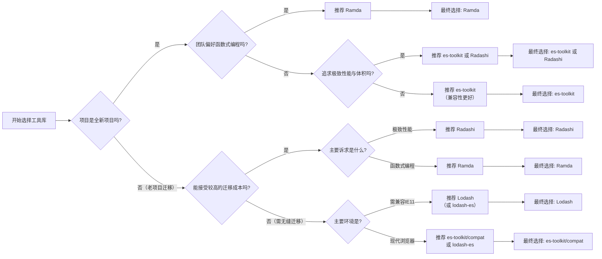

## 对比1
---

## 📊 核心库对比总览

| 库 | 定位 | 包大小 | TypeScript | 性能 | Tree-shaking | 维护状态 | 周下载量 | Stars |
|---|---|---|---|---|---|---|---|---|
| **Lodash** | 传统全能型 | ~24KB core / ~69KB full | 需额外安装 @types | 中等（兼容优先） | 支持（lodash-es） | 成熟但更新缓慢 | ~7400万 | ~61K |
| **Ramda** | 函数式编程 | ~1.2MB | 类型推断差 | 中等 | 支持 | 活跃 | ~1080万 | ~24K |
| **Radash** | 现代轻量工具库 | ~4.8KB gzipped | ✅ 原生支持 | 良好 | 优秀 | 原作者停止，社区接管中 | ~10万+ | ~4.8K |
| **es-toolkit** | Lodash现代替代者 | 比Lodash小 **97%** | ✅ 内置100%覆盖 | **极快**（2-11x Lodash） | 开箱即用 | 非常活跃（Toss维护） | ~150万+ | ~20K+ |
| **Radashi** | Radash社区分支 | 与Radash相近 | ✅ 改进的类型 | 良好 | 优秀 | 非常活跃（社区驱动） | 增长中 | ~2K+ |
| **Remeda** | TS-first工具库 | ~2.8MB | ✅ 一流支持 | 中等（惰性求值） | 支持 | 活跃 | ~50万+ | ~5.4K |
| **ModernDash** | TS-first Lodash替代 | 极小 | ✅ 严格模式无any | 超越Lodash | 优秀 | 活跃 | 较少 | ~500+ |
| **Just** | 独立微型工具集 | 每个包独立极小 | ✅ 每个包有类型 | 原生级别 | 天然支持 | 活跃 | 各包不同 | ~3K |
| **FxTS** | FP + 并发处理 | 中等 | ✅ 完全支持 | 高效（惰性求值） | 支持 | 活跃 | ~10万+ | ~1.2K |
| **Rambda** | Ramda极速版 | 极小 | 有支持 | **极快** | 支持 | 活跃 | ~50万+ | ~2K |
| **ts-belt** | ReScript风格FP | 小 | 优秀 | 极快 | 支持 | 活跃 | ~10万+ | ~1.2K |

---

## 🔍 各库详细优劣

### 1. Lodash

**优势：**
- 功能最全面，覆盖几乎所有数据操作场景
- 生态最成熟，文档丰富，社区庞大（周下载7400万+）
- 兼容性最好，支持旧浏览器（IE11+）
- 提供 `lodash/fp` 函数式编程版本

**劣势：**
- 包体积大，函数间存在隐式依赖，tree-shaking效果有限
- 基于ES5语法，代码冗长，难以阅读源码
- TypeScript类型需要额外安装 `@types/lodash`
- 大量功能已被原生ES6+取代（map/filter/reduce等）
- 维护更新缓慢，2026年仍有原型污染漏洞（CVE-2026-2950）
- 性能在现代环境中已非最优

---

### 2. Ramda

**优势：**
- 纯函数式编程设计，自动柯里化
- 数据后置（data-last）便于函数组合
- 丰富的函数组合工具（compose, pipe, converge等）
- 成熟的函数式编程生态，社区稳定

**劣势：**
- TypeScript类型推断差，类型支持被长期忽视
- `pipe` 语法不自然：`pipe(fn1, fn2)(value)` 需额外调用
- 学习曲线陡峭，需要函数式编程思维
- 包体积较大（~1.2MB）
- 性能在同类库中一般
- 不适合不熟悉FP的团队快速上手

---

### 3. Radash

**优势：**
- 零依赖，包体积极小（~4.8KB gzipped，仅为Lodash的1/5）
- 原生TypeScript编写，类型安全，类型守卫（type guards）真正可用
- 去除过时函数（如原生已支持的map/filter），不重复造轮子
- 异步工具优秀：`parallel`（并发控制）、`tryit`（错误处理）
- 源代码极简（如 `range` 仅3行），可直接复制到项目中使用
- 性能优于Lodash 

**劣势：**
- 原作者 Ray Epps 已停止维护，项目处于社区接管过渡期
- 功能覆盖不如Lodash全面
- 某些API与Lodash不兼容，迁移需适配
- 社区相对较小，第三方资源有限

---

### 4. es-toolkit ⭐ 最推荐

**优势：**
- **性能极快**：平均比Lodash快2-3倍，`omit` 快11.8倍，`pick` 快3.43倍 
- **包体积极小**：单个函数仅88-800字节，比Lodash小97% 
- **完全兼容Lodash**：提供 `es-toolkit/compat` 层，可无缝替换
- 内置TypeScript支持，100%测试覆盖率
- Toss公司（韩国独角兽，类似支付宝）维护，资金有保障
- 周下载量150万+，被Storybook、Recharts、CKEditor等使用 
- 提供AI集成（Claude Code、Cursor、Copilot插件）

**劣势：**
- 相对较新（2024年发布），长期稳定性待观察
- 某些边缘功能可能不如Lodash完善
- 社区生态仍在建设中

---

### 5. Radashi

**优势：**
- Radash的活跃社区分支，持续迭代改进
- 改进了Radash的类型定义和工具链（Vitest + Biome + PNPM）
- 社区驱动，接受PR速度快，有自动发布流程（patch/beta/next）
- 向后兼容Radash，迁移平滑
- 提供JSR.io包支持，方便Deno用户 

**劣势：**
- 知名度较低，Stars仅~2K
- 生态和文档不如es-toolkit完善
- 作为分支项目，长期路线图不确定

---

### 6. Remeda

**优势：**
- 第一个同时支持 **data-first** 和 **data-last** 的TypeScript工具库
- 一流的TypeScript支持，类型推断精准（如 `map` 可推断出tuple类型）
- 惰性求值（lazy evaluation）提升大数据处理性能
- 完全用TypeScript编写，类型即API
- 支持CJS/ESM/Deno/JSR多平台 

**劣势：**
- 性能在同类库中偏慢（比Rambda/ts-belt慢）
- 包体积较大（~2.8MB）
- 惰性求值在管道中使用有时不够直观
- 学习曲线比Lodash陡

---

### 7. ModernDash

**优势：**
- TypeScript严格模式，**无 `any` 类型**
- 现代浏览器优化，性能超越Lodash
- 100%测试覆盖率，零运行时依赖
- 不重复原生JavaScript功能，保持精简 

**劣势：**
- 功能覆盖有限（只包含有价值的工具）
- 社区很小，知名度低
- 不支持旧版Node.js（要求>=20.x）

---

### 8. Just

**优势：**
- 每个工具**独立成包**（如 `just-clone`、`just-debounce`），按需安装
- 零依赖，每个包都极小（部分仅几十字节）
- 支持ES5+浏览器
- 每个包都有TypeScript定义 

**劣势：**
- 需要安装多个包才能满足需求，管理成本高
- 没有统一的命名空间
- 没有管道/链式调用支持
- 不适合需要大量工具函数的项目

---

### 9. FxTS

**优势：**
- 惰性求值处理大数据/无限序列
- 强大的**并发请求控制**（`concurrent` 函数）
- 遵循Iterable/AsyncIterable标准协议
- 支持管道和链式两种风格 

**劣势：**
- 专注函数式编程场景，通用工具较少
- 学习曲线较陡
- 不适合只需要简单工具函数的场景

---

### 10. Rambda

**优势：**
- **极快的性能**（最难被超越）
- 包体积极小
- Ramda API兼容

**劣势：**
- 功能覆盖不如Ramda全面
- TypeScript支持仍有改进空间
- 社区较小

---

### 11. ts-belt

**优势：**
- ReScript风格API，类型安全
- 性能极快（比Remeda/Ramda快）
- data-first设计更直观 

**劣势：**
- ReScript风格可能不适合所有开发者
- 社区较小，文档相对有限

---

## 🎯 选型建议

| 场景 | 推荐库 | 理由 |
|---|---|---|
| **从Lodash迁移** | **es-toolkit** | API兼容，改一行import即可，性能提升2-11倍 |
| **全新TypeScript项目** | **es-toolkit** 或 **Radashi** | 现代、高性能、类型安全、社区活跃 |
| **函数式编程项目** | **Ramda** 或 **FxTS** | FP范式支持完善，函数组合能力强 |
| **需要惰性求值** | **Remeda** 或 **FxTS** | 内置lazy evaluation，大数据友好 |
| **对包大小极度敏感** | **Just** 或 **es-toolkit** | 按需加载或极小体积 |
| **遗留项目维护** | **Lodash** | 兼容性最好，文档最全，风险最低 |
| **需要并发控制** | **FxTS** | 内置concurrent控制，异步管道优秀 |
| **喜欢Ramda但嫌慢** | **Rambda** | 相同API，极致速度 |
| **ReScript风格偏好** | **ts-belt** | 类型安全+高性能 |
| **现代浏览器only** | **ModernDash** | 专为现代环境优化，严格TS |

---

## 📈 趋势观察

1. **Lodash正在衰退**：虽然仍是下载量之王，但越来越多的项目开始迁移到现代替代方案，2025年已有文章建议"告别Lodash" 
2. **es-toolkit崛起最快**：由Toss公司背书，API兼容+极致性能，是2025-2026年最热门的Lodash替代者，已发起与Lodash社区的协作迁移倡议 
3. **TypeScript-first成为标配**：新库都原生支持TypeScript，Lodash的后装类型模式已过时
4. **函数式编程库分化**：Ramda保持经典，Remeda/ts-belt/Rambda在TypeScript+性能方向竞争
5. **社区驱动模式**：Radashi证明社区可以成功接管并改进项目，成为可持续的维护模式

---

## 推荐2

### 一、 五大主流工具库深度对比

#### 1. Lodash
*   **简介**：诞生于 ES5 时代，前端工具库的“瑞士军刀”，拥有最庞大的生态。
*   **优势**：
    *   **功能极其全面**：提供 300+ 实用函数，几乎覆盖所有复杂数据处理需求（如深拷贝、链式调用）。
    *   **生态与兼容性无敌**：社区支持最完善，且完美兼容 IE11 等老旧浏览器。
*   **劣势**：
    *   **体积臃肿**：底层基于 ES5 语法，内部交叉引用导致 Tree-Shaking 不友好，即使按需引入也容易打包冗余代码。
    *   **类型支持滞后**：原生不支持 TS，依赖社区维护的 `@types/lodash`，容易出现类型报错。

#### 2. Ramda
*   **简介**：专注于“纯函数式编程（FP）”的工具库，强调不可变数据和函数组合。
*   **优势**：
    *   **极致的 FP 范式**：所有函数默认全参数柯里化，且严格遵循“数据最后（Data-last）”原则，极其适合 `compose` 和 `pipe` 组合。
    *   **声明式代码**：能写出高度抽象、无副作用的数据转换管道。
*   **劣势**：
    *   **学习曲线陡峭**：对不熟悉 FP 概念的开发者极不友好，过度抽象可能导致调试困难。
    *   **性能与体积开销**：完整的函数式抽象带来了额外的性能损耗，完整包体积约 30KB，大于许多现代工具库。

#### 3. Radash
*   **简介**：一个零依赖、TypeScript 优先的现代化轻量级工具库。
*   **优势**：
    *   **现代化与高性能**：基于现代 JS 特性，提供 Lodash 没有的新功能（如 `tryit`, `retry`），性能优异。
    *   **轻量与 TS 友好**：体积仅为 Lodash 的五分之一，提供开箱即用的精准类型推断。
*   **劣势**：
    *   **已停止维护**：原作者因精力原因于 2023 年 9 月停止维护，不再有新功能和安全更新。

#### 4. Radashi
*   **简介**：Radash 的活跃社区分叉（Fork）版本，被称为“继承且超越”的下一代工具库。
*   **优势**：
    *   **持续活跃**：社区维护积极，有严格的性能门禁和体积守护（新增函数大于 1KB 即触发 review）。
    *   **无缝迁移**：API 与 Radash 高度一致，只需全局替换 `from 'radash'` 为 `from 'radashi'` 即可零成本切换。
*   **劣势**：
    *   **生态仍在建设**：作为较新的分支，其生态完善度短时间内难以补齐 Lodash 的差距。

#### 5. es-toolkit
*   **简介**：旨在以极低迁移成本替代 Lodash 的现代工具库。
*   **优势**：
    *   **极致瘦身与提速**：相比 Lodash，整体体积缩小高达 97%，执行效率提升 2-3 倍。
    *   **平滑迁移**：提供与 Lodash 高度兼容的 API 和一键迁移方案，无需承担过高迁移风险。
*   **劣势**：
    *   **功能覆盖有取舍**：为了极致瘦身，删减了 Lodash 中的冷门接口，部分小众 API 功能未做到完整对齐。

---

### 二、 其他值得关注的同类工具库

除了上述五个，还有以下优秀的工具库可以作为补充或替代：

#### 1. Rambda
*   **简介**：早期定位为 Ramda 的替代品，现已专注于 TypeScript 优化和轻量级实现。
*   **优势**：包体积极小（核心约 8KB，仅为 Ramda 的 27%），执行速度比 Ramda 快 15-30%，且原生支持 TS 类型推导。
*   **劣势**：放弃了全参数柯里化（仅对前两个参数生效），无法完全作为 Ramda 的 Drop-in 替代品。

#### 2. moderndash
*   **简介**：针对大型企业级应用重构的高频函数现代化集合。
*   **优势**：剔除了 Lodash 的冷门功能，大幅降低团队学习成本，代码稳定性和测试覆盖率极高。
*   **劣势**：仅支持 ES2020+ 浏览器，完全无法兼容 IE11 等旧浏览器。

#### 3. lodash-es
*   **简介**：Lodash 官方提供的 ES Module 版本。
*   **优势**：对 Lodash API 有极强的依赖，不愿修改任何代码逻辑时的最佳选择；完美支持 Tree-Shaking。
*   **劣势**：底层依然是 ES5 时代的“老包袱”，无法享受现代 JS 引擎的性能红利。

#### 4. 原生 JavaScript (ES2020+)
*   **简介**：直接使用浏览器内置 API。
*   **优势**：零依赖、零体积、性能天花板。现代语法（如 `structuredClone`、可选链 `?.`）已能覆盖 Lodash 80% 的日常用例。
*   **劣势**：缺乏针对复杂场景的封装（如深比较、复杂分组），需要开发者自行处理边界情况。

---

### 三、 总结与选型建议

*   **新项目/性能敏感**：优先选择 **Radashi** 或 **es-toolkit**。前者适合追求极致性能和零依赖的现代应用，后者适合希望无痛替换 Lodash 的项目。
*   **重度函数式编程**：如果团队推崇 FP 范式，选择 **Ramda**（追求纯粹）或 **Rambda**（追求轻量与 TS 友好）。
*   **老旧项目/兼容 IE**：继续使用 **Lodash** 或 **lodash-es**，不要盲目升级。
*   **企业级求稳**：可以考虑 **moderndash**，用精简实用的 API 降低维护成本。

---

## 推荐3

### 1. Lodash
| 优势 | 劣势 |
|------|------|
| 函数最全（数组、对象、集合、函数、字符串等数百个），久经考验，生态和社区极其庞大 | 整包体积较大（约 70 kB gzipped），tree-shaking 后仍可能残留内部依赖 |
| 提供 `lodash/fp` 变体，支持不可变、自动柯里化、迭代器优先的函数式风格 | 许多函数已被 ES6+ 原生替代（如 `map`、`find`），继续使用会带来冗余 |
| 可按需加载（`import map from 'lodash/map'`），文档丰富且有中文资源 | 默认方法会修改原数组/对象，参数顺序（数据在前）不利于函数组合；类型定义需额外安装 `@types/lodash` |

### 2. Ramda
| 优势 | 劣势 |
|------|------|
| 专为函数式编程设计：所有函数自动柯里化，数据放在最后，完美适配 `pipe`/`compose` | 学习曲线很陡，概念抽象（Point-free、Lens、Transducer 等），对团队要求高 |
| 纯函数、不可变操作，不会副作用修改原数据 | 体积同样不小（约 50 kB gzipped），在大量数据处理时性能可能不如命令式或原生方法 |
| API 设计高度一致，逻辑性强，适合构建复杂的数据流 | 部分高级特性实际使用频率低，容易造成过度抽象，降低代码可读性 |

### 3. Radash（原版，已停更）
| 优势 | 劣势 |
|------|------|
| 完全 TypeScript 编写，零依赖，类型安全 | 函数数量少（约 90 个），不能覆盖 Lodash 的常用场景 |
| 极其轻量（全量约 10 kB gzipped），天然 ES 模块与 tree-shaking 友好 | 项目已停止维护，存在未修复的 bug，最终被重命名为 Radashi |
| 设计理念“不与原生抢活”，只补充 ES 缺少的工具（如 `tryit`, `retry`, `parallel`） | 社区极小，文档和示例不足，不建议在新项目中直接使用 |

### 4. es-toolkit
| 优势 | 劣势 |
|------|------|
| 性能非常突出（官方称部分函数比 lodash 快 2-3 倍），且按需打包后几乎无额外体积 | 项目很新（2024 年发布），API 可能变动，生产环境使用需评估稳定性风险 |
| 完整的 TypeScript 支持，提供 `es-toolkit/compat` 兼容层，可快速替换 lodash | 函数覆盖度仍不及 Lodash，一些冷门功能尚缺 |
| 积极维护，设计现代，颗粒度极细，tree-shaking 达到最优 | 社区极小，教程与问题解答很少，遇到问题只能看源码 |

### 5. Radashi（Radash 的社区继任版）
| 优势 | 劣势 |
|------|------|
| 延续了 Radash 的所有优点：TypeScript 优先、轻量、零依赖、现代 API | 与 Radash 存在不兼容的破坏性变更，老项目迁移需改代码 |
| 由社区积极维护，持续修复问题、增加新函数，文档也在完善 | 版本仍可能 < 1.0，API 未来仍有调整可能 |
| 拆包友好，适合在 TS 项目中作为轻量补充 | 函数总数仍然偏少，不能做 Lodash 的全功能替代 |

> 注：Radash 已停止开发，官方建议迁移到 Radashi，可以把 Radashi 看成 Radash 的重命名升级版。

---

### 其他同类实用函数工具库

**1. Underscore.js**
- **优点**：Lodash 的前身，极简稳定，体积小，适合轻量需求或旧项目兼容。
- **缺点**：功能比 Lodash 少很多，不支持 tree-shaking，基本停止演进，不推荐新项目使用。

**2. Rambda**
- **优点**：Ramda 的 TypeScript 重写版，更快、更小，API 大部分兼容 Ramda，自动柯里化且数据最后。
- **缺点**：缺少 Ramda 某些高级特性（如 lens），生态和知名度较小，更新速度不如 Ramda。

**3. Remeda**
- **优点**：TypeScript 优先设计，同时支持 data-first 和 data-last 风格，支持惰性求值，与 Lodash 一样可链式调用也可 pipe。
- **缺点**：学习成本中等，社区还不算大，但质量很高，正在快速成长。

**4. ts-belt**
- **优点**：专为 TypeScript 打造的函数式工具库，提供 `Option`、`Result` 等健壮类型，零依赖，tree-shaking 出色，类型极度安全。
- **缺点**：引入了新的编程范式，函数名多且需要理解函数式容器，对习惯命令式的开发者不友好。

**5. lazy.js**
- **优点**：惰性计算序列，处理大型或无限数据集时内存和性能优势明显，API 风格类似 Lodash 链式调用。
- **缺点**：专注于集合操作，不是全功能工具库，项目已长期停滞，不适合作为通用库。

**6. just (系列小包)**
- **优点**：每个函数独立为 npm 包（如 `just-omit`、`just-clone`），体积达到理论最小，按需使用极致优化。
- **缺点**：缺乏统一文档和聚合入口，管理多个小包繁琐，不适合需要大量工具的场景。

**7. micro-dash**
- **优点**：Lodash 的精简子集，只提供最常用函数，打包体积很小。
- **缺点**：功能太少，维护可能不积极，容易被 lodash-es + 深度 tree-shaking 替代。

**8. fp-ts**
- **优点**：为 TypeScript 提供高级函数式编程类型与工具（`Option`、`Either`、`Task` 等），类型安全性极高，适合编写健壮的业务逻辑。
- **缺点**：概念密集，学习曲线极为陡峭，严格来说不是“通用工具库”而是函数式框架，用来替代 Lodash/Ramda 需要完全改变编程范式。

---

### 简单选择建议

- **全面、稳定、兼容第一** → **Lodash**（可配合 `lodash-es` 做 tree-shaking，并逐步用原生方法替换）
- **纯粹函数式、数据流组合** → **Ramda** 或 **Rambda**（后者更轻快，TS 原生更好）
- **TypeScript 原生体验、轻量、现代** → **es-toolkit**（激进追新）或 **Radashi**（保守够用），二者可以互补 Lodash
- **追求极致类型安全+函数式** → **Remeda**、**ts-belt**
- **大量数据处理/惰性求值** → **lazy.js**（但注意其维护状态）
- **非全量，只想要几个零碎工具** → **just 系列**小包

可以根据项目的规模、团队技术栈以及对 bundle 体积的敏感度来组合使用，并不一定只选一个。

## 推荐4

### 📊 核心工具库对比一览

先通过一个表格快速了解这几个核心工具库的关键特性：

| 特性维度 | **Lodash** | **Ramda** | **Radash** | **es-toolkit** | **Radashi** |
| :--- | :--- | :--- | :--- | :--- | :--- |
| **核心设计哲学** | 功能全面、链式调用、兼容旧环境【turn0search18】 | **函数式编程**、自动柯里化、不可变数据【turn0search13】【turn0search16】 | 现代化、零依赖、类型安全【turn0search14】【turn0search27】 | **高性能**、极致轻量、兼容Lodash【turn0search2】【turn0search6】 | Radash的社区续作，**性能怪兽**、活跃维护【turn0search22】【turn0search26】 |
| **性能表现** | 兼容性优先，相对较慢【turn0search9】 | 不可变操作有性能开销，通常慢于Lodash【turn0search11】 | **优秀** (宣称比Lodash快1.5-2倍)【turn0search9】 | **卓越** (宣称平均快2-3倍，部分函数11倍)【turn0search2】【turn0search5】 | **极致** (宣称比Lodash快3-7倍)【turn0search9】【turn0search21】 |
| **包体积** | 大 (全量~71KB，按需仍较大)【turn0search9】 | 中等 (~16KB gzip)【turn0search11】 | **极小** (零依赖，Tree-Shaking友好)【turn0search14】 | **极小** (比Lodash减少最高97%)【turn0search0】【turn0search2】 | **极小** (比Lodash减少75%)【turn0search9】 |
| **TypeScript支持** | 需额外安装`@types/lodash`，类型推断弱【turn0search9】 | **原生支持**，类型推断优秀【turn0search11】 | **原生支持**，零`any`【turn0search14】 | **原生支持**，内置类型守卫 (如`isNotNil`)【turn0search2】【turn0search6】 | **原生支持**，零`any`，类型体验佳【turn0search22】 |
| **Tree-Shaking友好度** | **差** (内部交叉引用多，按需引入仍可能打包大量辅助函数)【turn0search21】 | 中等 (支持按需引入) | **优秀** (ESM原生模块设计)【turn0search14】 | **优秀** (天然支持，模块化设计)【turn0search2】【turn0search42】 | **优秀** (ESM原生模块设计)【turn0search22】 |
| **维护状态** | 更新缓慢，维护相对滞后【turn0search9】【turn0search21】 | 活跃 | **已归档** (作者停止维护)【turn0search21】【turn0search25】 | **非常活跃** (Toss公司维护，被知名项目采用)【turn0search2】【turn0search46】 | **非常活跃** (社区接管，nightly发版)【turn0search22】【turn0search26】 |
| **API风格** | 传统、链式调用 | 函数优先、数据最后 | **现代**、简洁，部分函数名与Lodash不同 | **兼容Lodash** (提供`compat`层)，API基本一致 | **现代**、简洁，API与Lodash不同 |
| **迁移成本** | - | **高** (API风格差异大，需重写代码)【turn0search17】 | **高** (API不同，需重写)【turn0search29】 | **极低** (提供`compat`层，可无缝替换Lodash)【turn0search5】【turn0search9】 | **高** (API不同，需重写) |
| **适用场景** | 老项目、需兼容IE、需要Lodash特定功能 | **函数式编程**范式、追求代码可组合性与可预测性 | 新项目、追求**极致轻量**与**类型安全**、现代环境 | **从Lodash迁移**、**新项目**、追求**性能**与**体积**、TypeScript项目 | 新项目或重构、追求**极致性能**、现代环境、社区活跃 |

---

### 🔍 各工具库深度解析

#### 1. Lodash：曾经的王者，时代的眼泪

**优点：**
*   **功能极其全面**：提供了300多个经过实战检验的实用函数，覆盖数组、对象、字符串、函数等各个方面【turn0search18】。
*   **链式调用优雅**：支持`_.chain()`风格的链式操作，代码可读性好【turn0search18】。
*   **兼容性无敌**：支持IE11及以下浏览器，是老项目的可靠选择【turn0search1】【turn0search29】。
*   **生态成熟稳定**：拥有庞大的用户基础和丰富的学习资源。

**缺点：**
*   **体积臃肿**：全量引入体积巨大，即使按需引入，由于内部模块化设计不佳，Tree-Shaking效果不理想，容易打包大量冗余代码【turn0search0】【turn0search9】【turn0search21】。
*   **性能瓶颈**：基于兼容旧环境的设计，未充分利用现代JS引擎特性，性能相对较慢【turn0search9】。
*   **TypeScript支持差**：需要额外安装`@types/lodash`，且类型推断较弱，开发体验不佳【turn0search9】。
*   **维护缓慢**：更新频率低，大量功能已被ES6+原生API替代，却未精简【turn0search9】【turn0search21】。

#### 2. Ramda：函数式编程的纯粹之选

**优点：**
*   **函数式编程典范**：所有函数自动柯里化，参数顺序设计为便于函数组合（数据置后），天然支持Point-Free风格，代码更声明式、可组合、可测试【turn0search13】【turn0search16】。
*   **不可变数据**：所有操作都返回新对象，与React等现代框架的理念契合，避免副作用【turn0search11】。
*   **类型推断优秀**：TypeScript支持良好，类型推断准确【turn0search11】。

**缺点：**
*   **学习曲线陡峭**：对于不熟悉函数式编程的开发者来说，理解`compose`、`pipe`、`curry`等概念有较高门槛【turn0search17】。
*   **性能开销**：不可变操作和函数组合会带来一定的性能开销，通常慢于Lodash【turn0search11】。
*   **API风格差异大**：与Lodash的命令式风格完全不同，迁移成本极高【turn0search17】。

#### 3. Radash：现代极简的探索者（已归档）

**优点：**
*   **零依赖**：完全零依赖，包体积极小，Tree-Shaking友好【turn0search14】。
*   **类型安全**：原生TypeScript编写，类型完整安全【turn0search14】。
*   **现代化API**：基于ES6+特性，API设计简洁，部分函数（如`tryit`、`parallel`、`retry`）很实用【turn0search14】【turn0search27】。
*   **源码可读性高**：源码简洁易懂，便于学习和调试【turn0search25】【turn0search27】。

**缺点：**
*   **已归档**：作者因精力原因已停止维护，不再更新，存在安全隐患【turn0search21】【turn0search25】。
*   **API不兼容Lodash**：函数名和参数不同，迁移成本高【turn0search29】。
*   **功能覆盖度**：不如Lodash全面，一些冷门但有用的功能缺失。

#### 4. es-toolkit：性能与兼容性的平衡大师

**优点：**
*   **性能怪兽**：通过充分利用现代JS API（如`Set`、`Array.includes`）和优化算法，性能平均提升2-3倍，部分函数提升11倍【turn0search2】【turn0search5】。
*   **体积极致**：比Lodash减少最高97%的体积，单个函数体积甚至可小于100字节，极大优化加载速度【turn0search0】【turn0search2】。
*   **兼容层平滑迁移**：提供`es-toolkit/compat`子包，函数签名与Lodash镜像级一致，官方提供codemod脚本，可实现90%自动替换，迁移成本极低【turn0search1】【turn0search5】【turn0search9】。
*   **TypeScript原生支持**：内置完整类型定义，提供`isNotNil`等有用的类型守卫【turn0search2】【turn0search6】。
*   **100%测试覆盖率**：经过严格测试，稳定可靠【turn0search6】【turn0search8】。
*   **被知名项目采用**：已被Storybook、Recharts、CKEditor等流行开源项目采用【turn0search2】【turn0search46】。

**缺点：**
*   **功能实现相对简单**：为了追求性能和体积，部分函数（如`omit`）的实现比Lodash简单，不支持深层属性路径等复杂场景【turn0search3】。
*   **API差异**：原生API与Lodash略有不同（如`debounce`的取消机制使用`AbortController`），需要适应【turn0search3】。

#### 5. Radashi：Radash的性能升级社区版

**优点：**
*   **极致性能**：作为Radash的社区续作，采用ES2020全新算法，性能比Lodash快3-7倍，是“性能怪兽”【turn0search9】【turn0search21】。
*   **活跃维护**：社区接管后维护非常活跃，有nightly发版，RFC公开投票，持续优化【turn0search22】【turn0search26】。
*   **零依赖与类型安全**：继承Radash的优点，零依赖、原生TS、零`any`【turn0search22】。
*   **现代API**：API设计现代简洁，包含`tryit`、`parallel`、`retry`等实用函数【turn0search9】。

**缺点：**
*   **API不兼容Lodash**：与Lodash函数名和参数不同，迁移成本高，需重写代码【turn0search29】。
*   **生态相对年轻**：虽然发展迅速，但相比Lodash和es-toolkit，其生态和社区资源仍在积累中。

---

### 🧰 其他值得关注的同类工具库

除了上述五个，还有这些库也各有特色：

| 库名 | 核心特点 | 优点 | 缺点 | 适用场景 |
| :--- | :--- | :--- | :--- | :--- |
| **lodash-es**【turn0search1】【turn0search29】【turn0search49】 | Lodash的**官方ESM分支**，API100%一致 | **迁移成本为零**（只需替换导入路径）、支持**Tree-Shaking**、体积比Lodash减少一半 | 仍是传统实现，性能提升有限，TypeScript支持仍需额外配置 | **老项目迁移**、想立即享受Tree-Shaking好处但不想改代码 |
| **moderndash**【turn0search29】 | 保留Lodash函数名，**内部用原生API重写** | **迁移平滑**（函数名95%一致）、性能提升2-4倍、体积减少70%、只保留高频70+函数 | 删减了冷门函数，可能不满足所有需求 | 想从Lodash迁移、希望减少学习成本、追求性能和体积 |
| **Underscore**【turn0search30】【turn0search32】 | Lodash的前身，更轻量 | 体积小（压缩后~4KB）、API简单 | 功能远不如Lodash丰富、性能未优化、社区已基本停滞 | 学习原理、极简项目 |
| **futil-js**【turn0search10】 | Lodash的**函数式编程补充库** | 为Lodash提供更友好的函数式接口 | 需配合Lodash使用、学习成本 | 已深度使用Lodash但想引入函数式编程 |

---

### 🧭 如何选择适合你的工具库

你可以根据下面的决策流程图，结合项目情况快速做出选择：

#### 📋 简明选择建议

*   **新项目，追求性能、体积和开发体验**：**首选 es-toolkit**。它平衡了性能、体积、类型安全和兼容性，迁移成本低，是大多数新项目的最佳选择。
*   **新项目，追求极致性能且不惧迁移**：可考虑 **Radashi**。性能怪兽，社区活跃，但API与Lodash不同，需重写代码。
*   **新项目，坚定拥抱函数式编程**：选择 **Ramda**。它是JS函数式编程的标杆，但学习曲线陡峭。
*   **从Lodash迁移，不想改代码**：
    *   需兼容IE11：继续用 **Lodash** 或 **lodash-es**（后者支持Tree-Shaking）。
    *   现代环境：用 **es-toolkit/compat** 或 **lodash-es**。前者性能更好，后者迁移更无缝。
*   **从Lodash迁移，可接受少量代码改动**：**moderndash** 是个不错的选择，迁移平滑且性能提升明显。
*   **维护老项目，需兼容IE11**：**Lodash** 仍是可靠选择。
*   **学习函数式编程**：从 **Ramda** 开始。

> 💡 **趋势提示**：整个JS生态正在从“大而全”的Lodash转向“小而精”的现代工具库。**es-toolkit** 和 **Radashi** 代表了未来的方向，它们在性能、体积、类型安全等方面具有显著优势。对于新项目，强烈建议优先考虑它们。

---

### 💎 总结

选择工具库本质上是权衡：**功能全面性** vs **性能与体积**，**迁移成本** vs **长期收益**，**学习曲线** vs **开发效率**。

*   **Lodash** 已完成历史使命，新项目不推荐。
*   **Ramda** 是函数式编程的纯粹之选，但曲高和寡。
*   **Radash** 已归档，不建议新项目采用。
*   **es-toolkit** 是**当前最推荐的“全能选手”**，尤其适合从Lodash平滑迁移。
*   **Radashi** 是**追求极致性能的“特种兵”**，适合重构或新项目且不惧迁移成本。